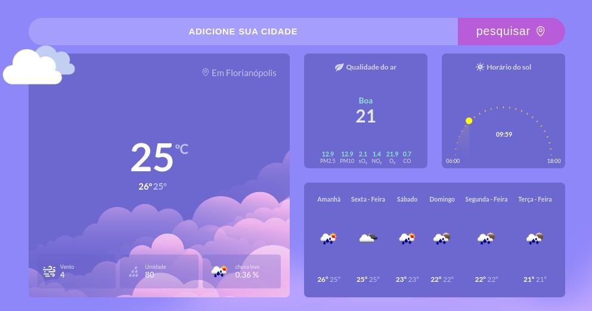

<h1 align="center"> TOMORROW WILL RAIN?</h1>

   This is a weather forecast page that provides accurate information about weather conditions in real time.

  <a href="#-tecnologias">Technologies</a>&nbsp;&nbsp;&nbsp;|&nbsp;&nbsp;&nbsp;
  <a href="#-projeto">Project</a>&nbsp;&nbsp;&nbsp;|&nbsp;&nbsp;&nbsp;
  <a href="#-layout">Layout</a>&nbsp;&nbsp;&nbsp;|&nbsp;&nbsp;&nbsp;
  <a href="#memo-licença">License</a>

  

   <a href="">TO ACESS THIS APP   CLICK HIRE</a>

 

  

## 🚀 Technologies

This project was developed with the following technologies:

- HTML e CSS - JavaScript 
- OpenWeather API

## 💻 Project

 This is a weather forecast page that provides accurate information about weather conditions in real time.

## 🔖 Layout

To test the project you can access through  [THIS LINK]()

## :memo: Licença

This project is under the MIT license.

---

Made with ♥ by Charles
